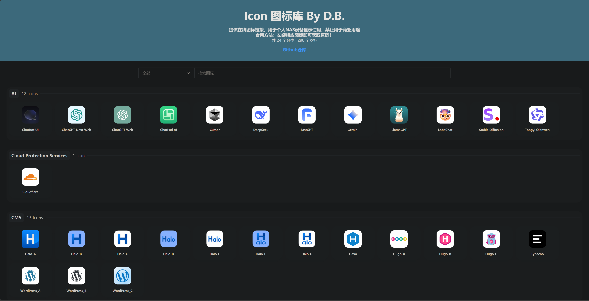

# My Icon


- 原项目：[heizicao/My Icon](https://gitee.com/heizicao/my-icon)
- 修改版：[Siriling/my-icons](https://github.com/Siriling/my-icons)
- 参考布局：[oliver556/my-icons](https://github.com/oliver556/my-icons)

基于My Icons项目修改，提供在线图标链接，用于个人NAS设备显示使用，禁止用于商业用途！

---

### 使用

- [Github-Pages](https://davidblackcn.github.io/my-icons)
- [EdgeOne镜像](https://icon.davidblackcn.cc)
- 点击相应图标即可获取URL



---

### 本地部署

开发要求：[Node.js](http://nodejs.org/)

克隆代码仓库：
```shell
git clone https://github.com/DavidBlackCN/my-icons.git
```

安装依赖：
```shell
npm install
```

启动开发服务：
```shell
npm run serve
```


